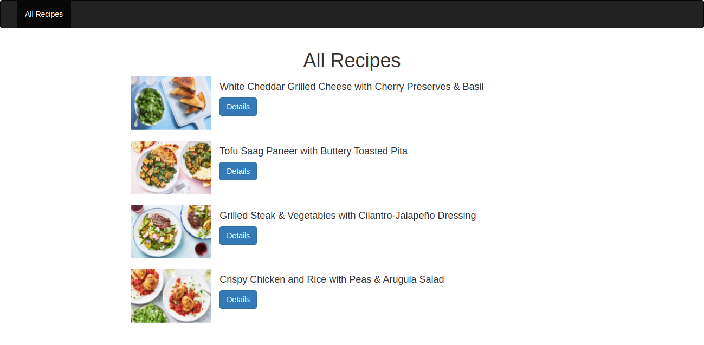

# README

An example application to show recipes from contentful api.

* Install Ruby version: `2.4.0`

* Clone the app and go to the project directory

* Add `ACCESS_TOKEN` and `SPACE_ID` in `config/local_env.yml` file 

* run `bundle install`

* No database configuration required

* run `rails s`

* Open browser and go to `http://localhost:3000/`

* You can see recipes index and recipe show page 

* For test cases run `rails test` 
